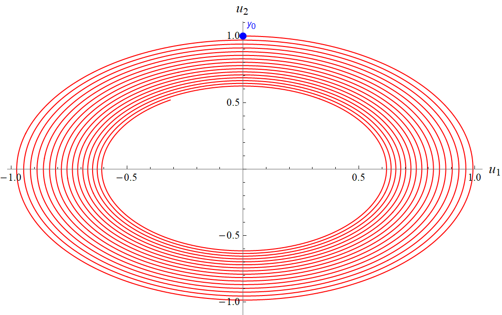
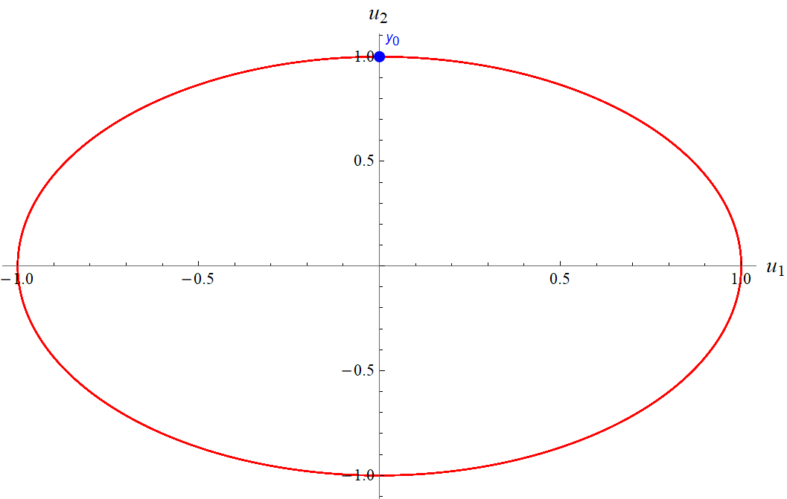
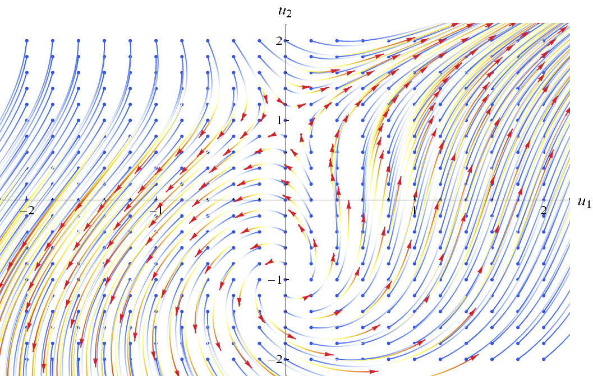
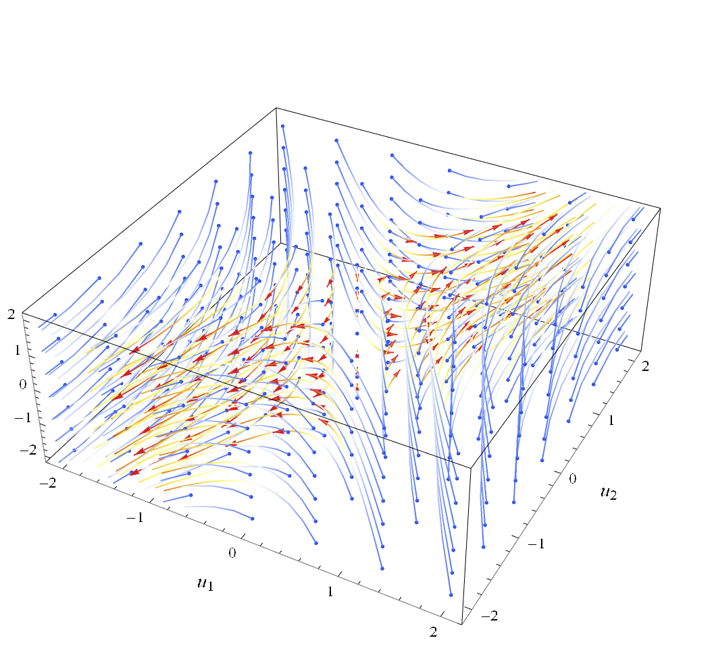

# ODE Solvers

A lab done as part of a course in numeric methods. Contains naive implementations of the following ODE solvers:

* Explicit Euler's method

* Implicit Euler's method

* Symmetric Euler's method

* 2nd order Runge-Kutta method

* 4th order Runge-Kutta method

* 4th order Runge-Kutta method (with adaptive step size)

* 4th order predictor-corrector method

* 4th order Adams method (linear multistep method)

## Compilation

* Requires C++17 support

## Dependencies

* Eigen 3.4.0.

## Usage

Use "odeproblems.hpp" to config equation, initial conditions, precision and etc.

All solutions are saved to "[output]/" by default, where they can be visualzed by launching "Visualization.nb" (requires a valid WolframMathematica license).

## Visualization examples

Harmonic equation solution can be used to show how some methods affect total energy of a system. Here, implicit Euler's method shows its tendency to loose energy over time, while symmetric Euler is consercative:

By solving a problem for a small time interval on a given grid one can obtain phase portrait of a system:

Since there is no inherent limitation of system dimensionality, same can be done in 3D:

## Version History

* 00.01

    ** Final release

## License

This project is licensed under the MIT License - see the LICENSE.md file for details